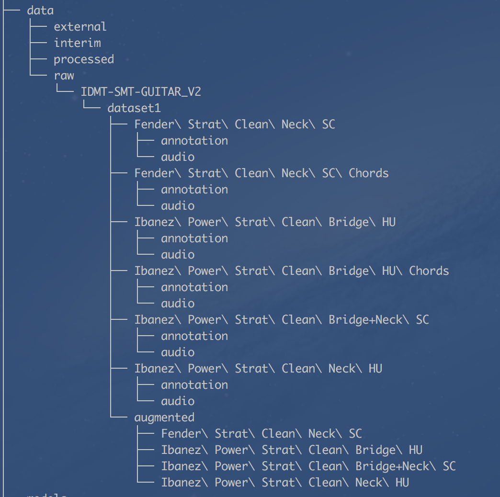
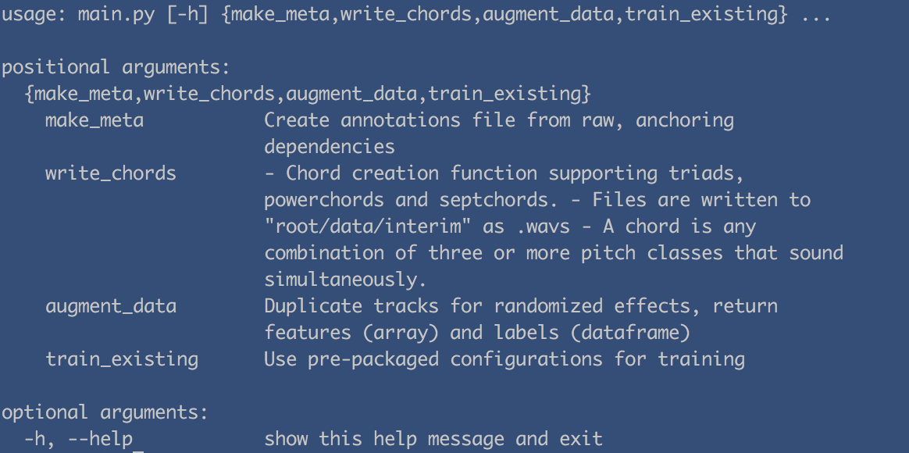
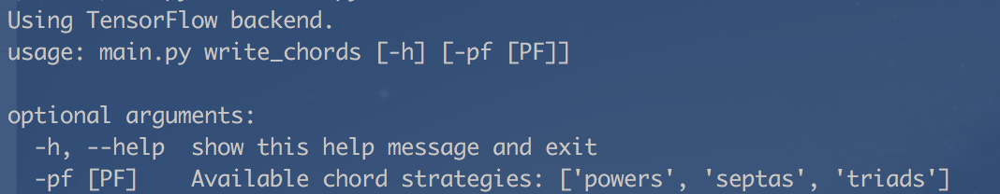
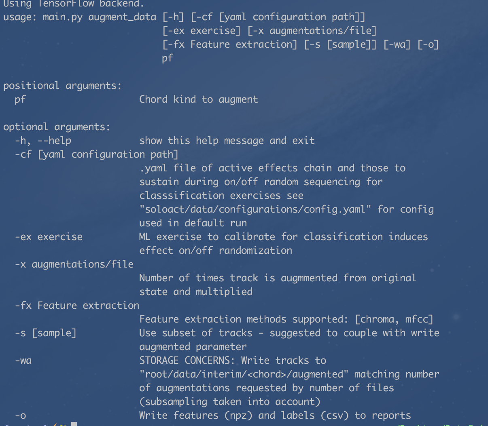
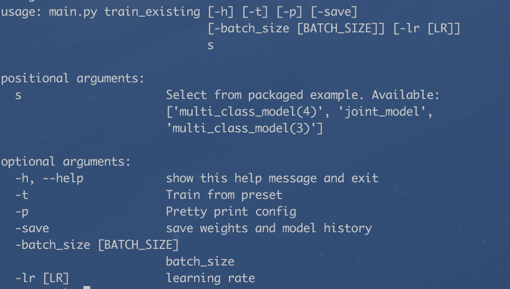
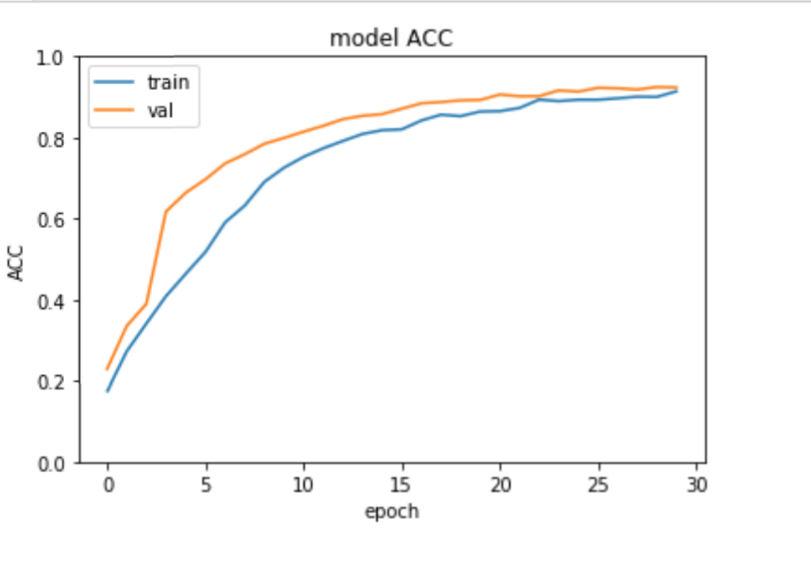
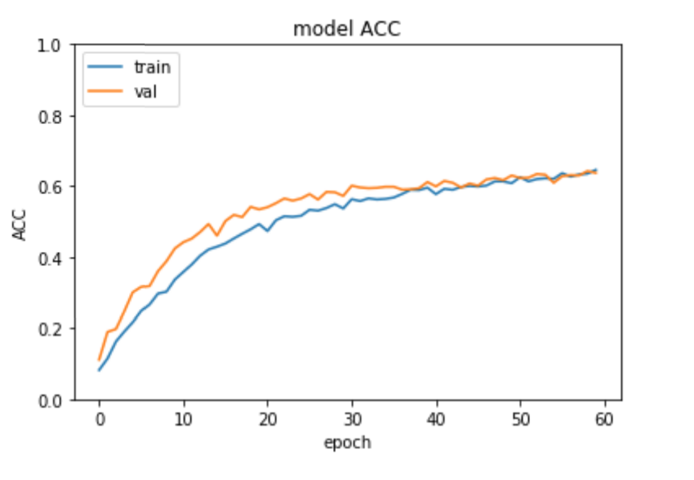
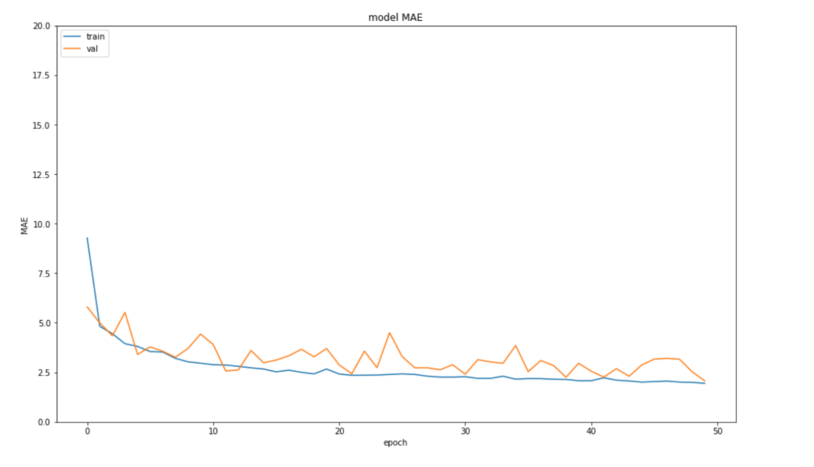

# SOLO ACT

"Music has often thrived on transforming faults into influential sound effects. Before professional studio production enabled granular tweaks in sound, standalone guitar effects emerged from deliberately converting hardware faults—often caused by the limitations of amplifiers—into positive features."


https://www.theatlantic.com/technology/archive/2015/03/what-makes-an-electric-guitar-sound-like-an-electric-guitar/386441/


Acceptable commercial sounds are, now, so far obfuscated in precision and nuanced effect, that a previously trivial, save talent and hard work, undertaking of emulating your idol now comes with great culpability.

Soloact hopes to stave off tired ears and the idiosyncrasies of sound engineering with a machine solution for guitar effect detection using deep neural networks.  We also aim to engage the average guitar-playing Joe(ess) with a suite of educational tools to help build a progressive understanding of audio profiling.


**
A Batch-15 Capstone project - Data Science Retreat, Berlin, 2018.**

## Getting Started

These instructions will get you a copy of the project up and running on your local machine for development.

### Prerequisites

- Python 3.6
- Conda
```
https://conda.io/docs/user-guide/install/macos.html
```
- IDMT Data (reg. required)
```
https://www.idmt.fraunhofer.de/en/business_units/m2d/smt/guitar.html
```
- Having moved dataset1 to your data/raw directory your folder structure should look something like this

<!--  -->


### Installing

```
conda install --yes --file requirements.txt

```

# DATA
=======

## Foundations

"The IDMT-SMT-GUITAR database is a large database for automatic guitar transcription. Seven different guitars in standard tuning were used with varying pick-up settings and different string measures to ensure a sufficient diversification in the field of electric and acoustic guitars..."

"The dataset consists of four subsets. The first (*SOLOACT*: what we use) contains all introduced playing techniques (plucking styles: finger-style, muted, picked; expression styles: normal, bending, slide, vibrato, harmonics, dead-notes) and is provided with a bit depth of 24 Bit."

https://www.idmt.fraunhofer.de/en/business_units/m2d/smt/guitar.html

We don't venture into the available polyphonic data. Instead we mix monophonic pitch classes into 3 commonly utilized chord structures; triads, powerchords and septachords at strict 44100 Hz sampling rates.

### Powerchords

- https://www.youtube.com/watch?v=ik9TGv4YNX8

## Engineering

We programmatically mix tracks with combinations of overdrive, reverberance, chorus, phaser - feeling these best capture hallmark sounds of electric guitar play. Some effects are permitted randomization between on/off states while others i.e. overdrive are too audibly fundamental for this kind of intermittence. To capture granularity, and realistic waveforms, we impose strict bounds on each effect with values transcribed by headphones and hand. The following image depicts a clear response of powerchord waveforms to multi-effect augmentations.

<!--  -->


##### Video detailing effects used

- https://www.youtube.com/watch?v=MpHA8hoc9SU

## Feature extraction

#### MFCC

Nothing special here, we use MFCCs to capture frequency domain characteristics - taking mean values to condense representations. Mels are well suited to mimic how humans hear.


## TUTORIAL

**Draft**

### End-to-End with the command line
======

As part of our intention to educate all major features are operable from root's main.py accessible with conventional argparse notation.

```
python main.py -h
```

<!--  -->


##### 1. PARSE ANNOTATIONS
======

The IDMT-SMT-Guitar dataset contains track-wise xml annotations.
These are necessary for labelling training data and anchoring our name-based dependencies.

```
python main.py make_meta -r
```

##### 2. GENERATE CHORDS
======

- Choose between triads, powerchords and septchords so you can start augmenting
- You'll find how strategies are composed in "soloact/soloact/data/strategies" folders

<!--  -->


##### 3. Augment your data
======

Notes:

- We offer mandatory feature extraction between Chroma and MFCCs as means of reducing storage required for training data but feel compelled to offer more flexibility in the near future.
- Using the "-wa" argument will write augmented tracks to a nested directory in the "data/interim/" folder. Raw files can be large so please contemplate subsampling with 's' then writing your augmented tracks.  
- Modeling your data for classification will induce randomized on/off states at the effect level for those not required to persist - see "soloact/models" for .yaml configs used in the subsequent function  - train existing.

```
python main.py augment_data -h
```

<!--  -->


Here we call augment powerchord data with 5 augmentations for each of our 5 tracks, extracting MFCCs and writing to our reports folder. The chord kind is mandatory and -o evaluates to True if flagged.

```
python main.py augment_data -x 5 -fx mfcc -s 5 -o powers
```

You should be greeted with a progress bar.

<!--  -->


##### 4. Training
======

We have included sample features, labels and configurations for you to train with for a variety of tasks.

- 3 effect classification model
- 4 effect classification model
- Joint classification / regression model

```
python main.py train_existing -h
```

<!--  -->


```
python main.py train_existing -t -p -save 'multi_class_model(4)'
```


<!--  -->


#### 5. Evaluation
======

###### Classification
======

3-class classification
(Overdrive, Chorus, Reverb)



**90 % accuracy**

4-class classification
(Overdrive, Chorus, Reverb, Phaser)



**63% accuracy**

###### Regression
======

Overdrive predictions (out of 100)




<!---
< To Do >


## Testing

 ## Contributing


## Versioning

We use [SemVer](http://semver.org/) for versioning. For the versions available, see the [tags on this repository](https://github.com/your/project/tags).

## Authors

* **Billie Thompson** - *Initial work* - [PurpleBooth](https://github.com/PurpleBooth)

See also the list of [contributors](https://github.com/your/project/contributors) who participated in this project. --->

### Glossary

- https://en.wikipedia.org/wiki/Pitch_class
- https://en.wikipedia.org/wiki/44,100100_Hz

## License

This project is licensed under the MIT License

## Acknowledgments

* Dr. Tristan Behrens - https://github.com/AI-Guru
* Adam Green - https://github.com/ADGEfficiency
